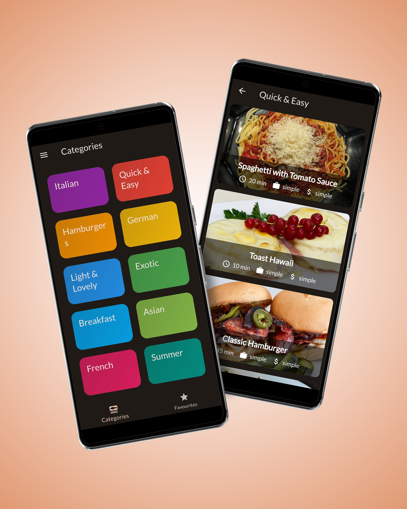
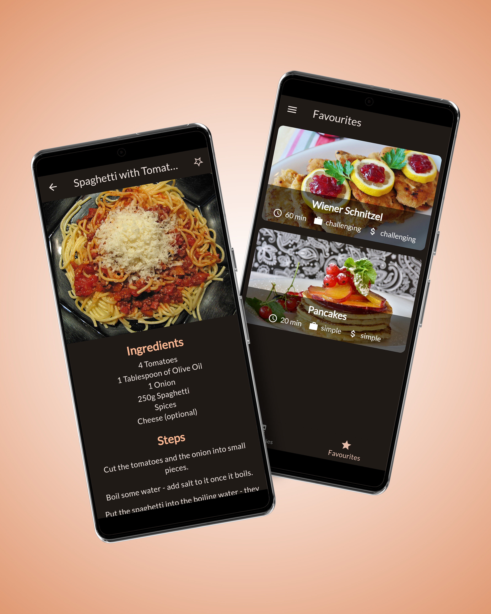
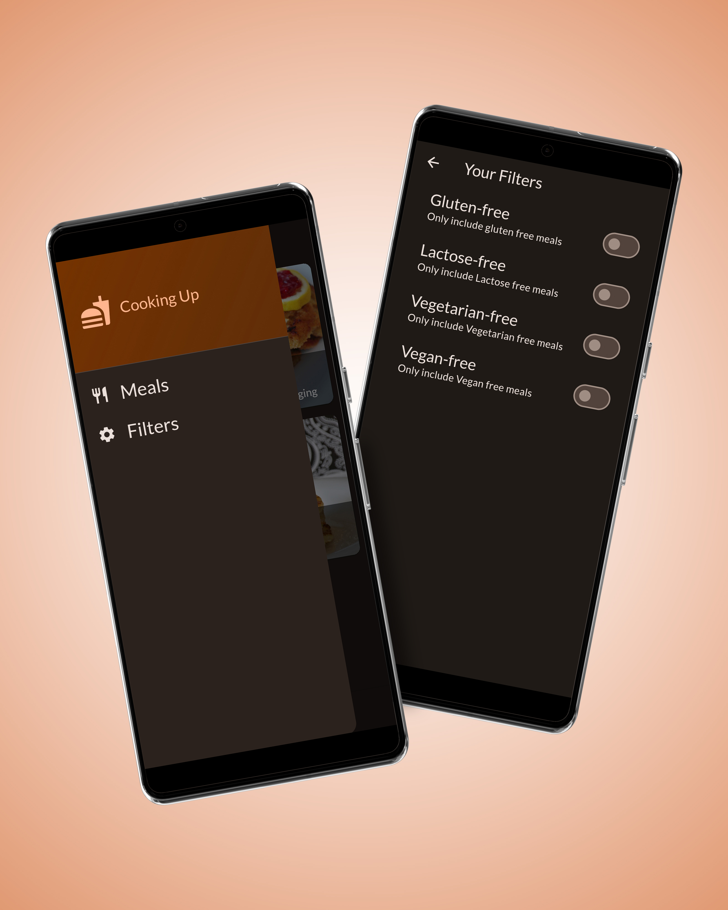

# Meal App

## My Screens:
  
  

  
  
  

## Description:
The Meal App is designed to help users browse and explore a variety of meals. It features categorized meal lists, detailed descriptions, and the ability to mark meals as favorites.

## Features:
### Categorized Meals: 
Browse meals organized by categories for easy navigation.
### Meal Details: 
View detailed descriptions of each meal, including ingredients and preparation methods.
### Favorites:
Mark meals as favorites and view them in a dedicated section.
### Sorting and Filtering: 
Sort and filter meals based on different criteria to find the perfect meal.